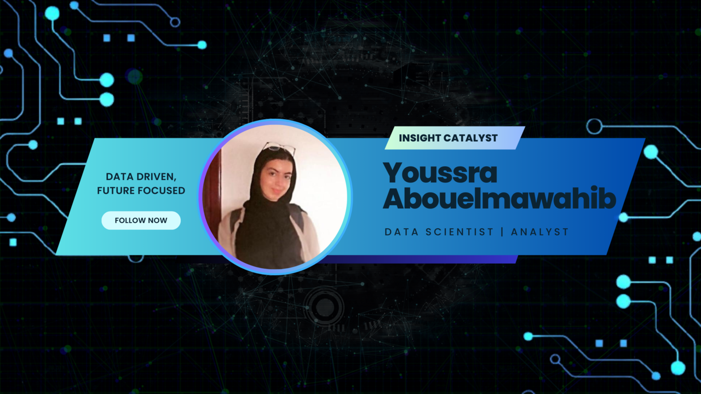

<!--   -->
<h1 align="center">Hello World 👋</h1>
<h3 align="center">A passionate Data Scientist from Morocco</h3>

  

<table width="100%">
  <tr>
  <th>About me</th>
  <th>Technologies </th>
  </tr>
  <tr>
  <td width="50%">

   
&nbsp; &nbsp; I'm passionate about Data Science ... , I'm interested in NLP , Generative AI , programming and UI/UX Design . - 🌱 I’m currently 
    learning Data Science

- 💬 Ask me about  NLP , AI ,Generative models , Prompt Engineering 

  
  
  
  
  
   
  

  </td>
  <td width="50%">

 

  
  
  
  
  
  
  
  
  
  
  
   
   
   
   
    
 

  </td>
  <tr>
  <td width = "50%">
   
  

  </td>
  <td width = "50%">
   
  

  </td>
  </tr>
  </table>
 

<h3 align="left">Connect with me:</h3>

## Join the Guild of Visionaries:

